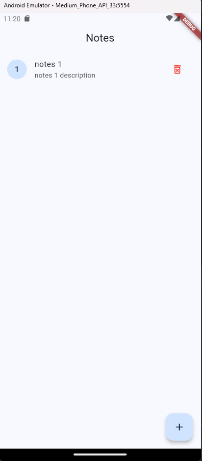
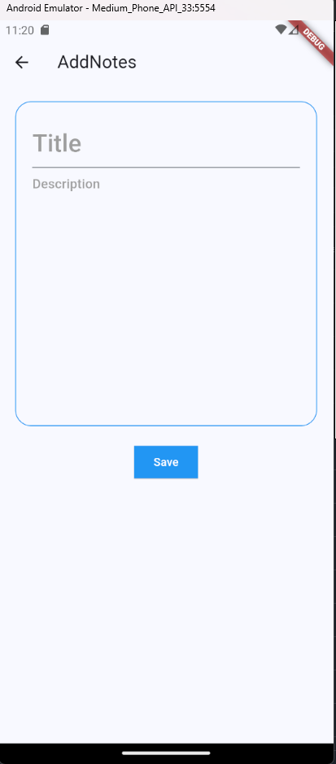
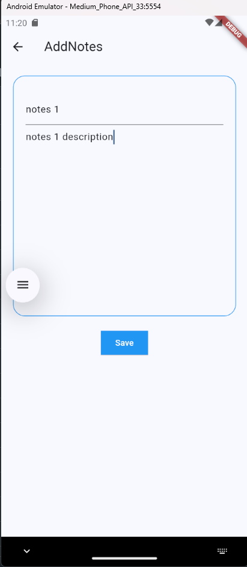
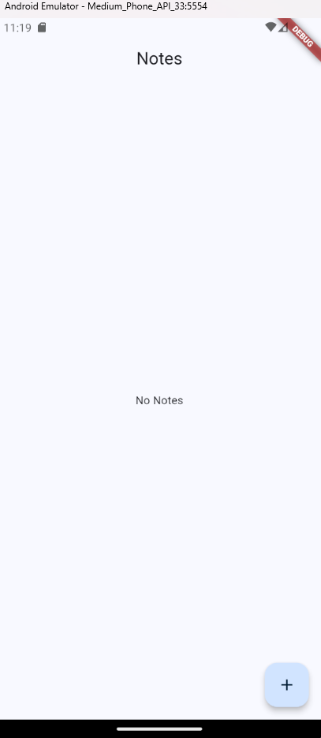

# Notes App 📝

Welcome to the **Notes App**, a simple and basic practice app built with Flutter to store notes locally using `SharedPreferences`. This app serves as a practical example for storing and retrieving data locally without needing a backend.

## Features ✨

- 📒 **Create Notes**: Add your own notes and store them locally.
- 📋 **View Notes**: See all the notes you have added in a clean list.
- 🗑️ **Delete Notes**: Remove notes easily with a single tap.
- 💾 **Local Storage**: Data is stored locally on the device using `SharedPreferences`.

## Screenshots 📸

Here are some screenshots of the app in action:

1. **Notes List**:
    

2. **Add Note**:
    

3. **Delete Note**:
    

4. **No Notes**:
    

## How to Run 🛠️

To run this app on your local machine:

1. Clone the repo:
   ```bash
   git clone [https://github.com/yourusername/notes-app.git](https://github.com/farehahassan/notes_app-using-sharedPrefrences)
   ```
   
2. Navigate to the project directory:
   ```bash
   cd notes_app-using-sharedPrefrences
   ```

3. Install dependencies:
   ```bash
   flutter pub get
   ```

4. Run the app:
   ```bash
   flutter run
   ```

## Technologies Used 💻

- **Flutter** for the app development.
- **SharedPreferences** for local data storage.
- **Dart** as the programming language.

## Contribution 🤝

Feel free to open issues or make pull requests if you would like to contribute to this project. This is a simple app for learning purposes, and feedback is always appreciated!


Made with ❤️ by Fareha Hassan
```
